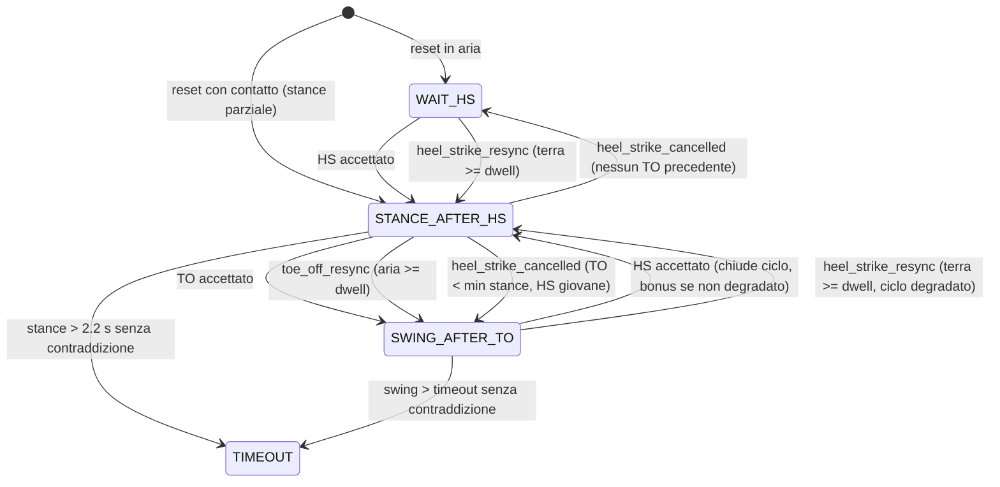

# Design FSM attore v3 — resync, cancellazione HS, bootstrap verificato

Data: 2026-08-21 — stato: DESIGN DA APPROVARE (nessun codice toccato)
Contratto: `binary_point_v25+heel_qualified_fsm_v3` (detector V26 intoccato)

## 1. Diagnosi precisa del difetto v2 (da codice e trace)

`ProstheticPhaseFSM` (`Trajectory Generator/prosthetic_phase_fsm.py`) ha
regole d'igiene fail-closed ma **nessuna via di recupero** dopo un rigetto:

- `_handle_toe_off` in STANCE: TO a meno di `min_stance_duration_s` (50 ms)
  dall'HS → `to_too_early_after_hs`, stato invariato. Il TO fisico è perso
  per sempre (il detector non lo riemette); il piede è in aria ma la FSM
  resta in STANCE; l'HS successivo arriva in STANCE → `double_hs_before_to`,
  anch'esso rigettato → **lock fino allo stance hard timeout (2,2 s)** →
  episodio terminato. È la sequenza osservata nei 3 rollout di qualifica e
  nel best ex-novo (rimbalzo del tallone al secondo ciclo).
- Simmetrico: `hs_too_early_after_to` (HS a < 0,2 s dal TO) → FSM in SWING
  col piede a terra → lock fino allo swing timeout.
- Ciò che **funziona già**: `reset_from_binary_baseline` +
  `_bootstrap_partial_stance` (start con contatto → stance parziale non
  accreditata, primo TO esente dai gate; start in aria → WAIT_HS, primo HS
  accettato senza gate). Il bootstrap mid-ciclo non è la causa dei lock.

## 2. Stati e segnali (invarianti)

Stati invariati: WAIT_HS(0), STANCE_AFTER_HS(1), SWING_AFTER_TO(2),
VALID_CYCLE_COMPLETED(3), TIMEOUT(4), INVALID_EVENT(5).
`observation()` **byte-identica** alla v2 (8 feature: nessuna nuova chiave).
Segnale di verità per il resync — **corretto dopo L1 (2026-08-21)**: il
**latch funzionale di stance del detector** (`in_contact`/`gait_phase` del
payload binario V26: STANCE dal HS qualificato fino al TO), passato
dall'adapter come kwarg `binary_contact: bool`. NON il contatto stabile
grezzo: nel contratto heel-qualified il contatto di sola punta è swing
legittimo (trascinamento), e usarlo come verità genera contraddizioni
spurie (L1: 8–9 resync e cicli validi azzerati su trace puliti). Con il
latch, detector e FSM attore sono guidati dagli stessi eventi: nessuna
contraddizione in cammino nominale, contraddizione solo dopo un rigetto.
`in_contact` (GRF primaria) resta per evidenza di carico e crediti.

## 3. Meccanica A — Resync su desincronizzazione (nuovo)

Monitor valutato **a ogni confine di policy** in `_finish_policy_step`,
dopo `_process_events` e prima dei punteggi:

```
contraddizione := (state == STANCE and not binary_contact)
              or (state in {SWING, WAIT_HS} and binary_contact)
se contraddizione: accumula t_contra (dal primo confine contraddittorio)
altrimenti:        t_contra = None
se t_contra >= resync_dwell_s (default 0.08 s):
   STANCE & aria     → transizione "toe_off_resync"
   SWING/WAIT & terra→ transizione "heel_strike_resync"
```

Effetti di `toe_off_resync`: chiude il segmento stance come **invalido**
(`segment_valid=0`), stato → SWING_AFTER_TO,
`last_valid_to_time = t_contra_start` (stima del TO fisico = perdita del
contatto), **nessun credito TO**, nessuna `pending_cycle_credit`
(il rigetto che l'ha preceduto ha già applicato clawback e failure
penalty: il resync non penalizza una seconda volta), `cycle_degraded=True`.

Effetti di `heel_strike_resync`: chiude lo swing come invalido, stato →
STANCE_AFTER_HS, `last_valid_hs_time = t_contra_start`, progress 0.25,
nessun credito HS, apre un nuovo ciclo con `cycle_degraded=True`; se
chiudeva un ciclo HS→HS, quel ciclo è rigettato (nessun bonus).

Regola dei cicli degradati: un ciclo che contiene almeno una transizione
resync **non può** guadagnare `cycle_complete_bonus`; l'HS valido
successivo lo chiude come `cycle_valid=False, reason="cycle_degraded"` e
riparte pulito. Invariante di monotonia: credito(degradato) ≤ credito(nominale)
sempre.

Timeout hard invariati e mantenuti come ultima risorsa: con il resync
possono scattare solo se il contatto **non contraddice mai** lo stato
(stance realmente > 2,2 s, aria realmente > swing timeout) — cioè
fallimenti fisici veri. Follow-up fuori scope v3: riportare lo swing
timeout da 2,6 a 1,3 s una volta che il resync rende inutile la stampella.

## 4. Meccanica B — Cancellazione dell'HS rimbalzato (nuovo)

In `_handle_toe_off`, stato STANCE non parziale, `stance_elapsed <
min_stance_duration_s` (oggi → `to_too_early_after_hs`):

```
se l'HS corrente non ha chiuso un ciclo valido (è un HS "giovane"):
   transizione "heel_strike_cancelled": chiude lo stance aperto come
   invalido; ripristina last_valid_hs_time al valore precedente,
   valid_hs_count -= 1; stato → SWING_AFTER_TO se esiste last_valid_to_time
   altrimenti WAIT_HS; _mark_invalid("hs_bounce_cancelled")
   (clawback del pending HS + failure penalty, come oggi: il rimbalzo
   resta un comportamento penalizzato, ma la FSM resta coerente)
altrimenti (HS che ha già chiuso un ciclo valido): comportamento v2
   invariato (to_too_early_after_hs) — poi il resync A recupera.
```

Il TO del rimbalzo non viene pubblicato né accreditato. Il periodo/stance
fraction non vengono aggiornati dal ciclo cancellato.

## 5. Meccanica C — Bootstrap phase-aware (verifica, nessuna modifica prevista)

Il codice v2 copre già start in stance (parziale, TO esente) e in aria.
v3 aggiunge SOLO test (L0 sweep su 8 fasi; L2 su 20 offset) e, se un test
rivela un gap, l'unica modifica ammessa è seminare `_stance_anchor_time`
dal gait clock per il calcolo del timeout. Niente HS sintetici a t0.

## 6. Journal delle transizioni e compatibilità dei consumatori

Nuovi nomi evento nel journal `accepted_transitions_this_step`:
`toe_off_resync`, `heel_strike_resync`, `heel_strike_cancelled` — stessi
campi dei record esistenti (onset = `t_contra_start` o onset dell'HS
cancellato, confirmed = delivered = confine corrente), `segment_valid=0`,
`anchor_geometry_valid=0`, `cycle_valid` secondo §3.

Consumatori da adeguare (tutti con test):
- **adapter** (`binary_phase_adapter.py`): `_validate_transfer` e
  `_accepted_left_events` filtrano già solo `heel_strike`/`toe_off` → i
  nuovi nomi non sono pubblicati come eventi left né contati nel transfer
  (comportamento corretto by construction; test esplicito).
- **corridoio** (`experimental_morphology_corridor.py`): il validatore v26
  deve trattare i tre nuovi nomi come `timeout` (nessun gemello detector
  richiesto); `_process_transition` deve chiudere/scartare il segmento
  attivo con reason `resync`/`hs_cancelled` (scarto ordinario, **mai**
  `morphology_causal_failed_closed`). Pin del contratto esteso a v3.
- **env/reward**: nessuna modifica di schema osservazioni; nuovi contatori
  nel payload FSM: `resync_event_this_step`, `resync_count`,
  `hs_cancelled_count`, `cycle_degraded` (telemetria e gate dei test).

## 7. Parametri e feature flag

`ProstheticPhaseFSMConfig` (+): `resync_enabled: bool=False`,
`hs_cancel_enabled: bool=False`, `resync_dwell_s: float=0.08`,
`resync_contact_source: str="binary"` (alternativa `"primary"`).
Con entrambi i flag False la v3 è **byte-identica alla v2** (test L0
dedicato). Il contratto `heel_qualified_fsm_v3` li attiva entrambi; il
contratto v2 resta selezionabile (riproducibilità B0820).

## 8. Diagramma (v3, solo le vie nuove in grassetto concettuale)



## 9. Mappa design → test (piano 2026-08-21_piano_test_fsm_v3_resync.md)

| Meccanica | L0 | L1 | L2 | L3 |
|---|---|---|---|---|
| A resync | TO precoce+aria → resync ≤ dwell; aria breve → nessun resync; monotonia crediti; timeout ancora raggiungibili | desync 2,2 s → ≤ dwell sui lock noti | sweep 20 start, 100 % cicli | niente stance-lock; muri −50 % |
| B cancel | rimbalzo 20/40/49 ms → HS annullato, stato coerente; rimbalzo dopo ciclo valido → via v2 + resync | replay qualifica: ciclo 2 recuperato | perturbazione rimbalzo iniettata | idem |
| C bootstrap | 8 fasi di start | — | 20 offset | 3 start + 10 casuali |
| Compat | v3 flag off ≡ v2 byte-identica; adapter non pubblica i nuovi nomi | journal completo, receipt | corridoio: 0 contract failure da resync | contract failure giù |

## 10. Fuori scope dichiarato

Nessuna modifica al detector V26 (geometria, debounce, qualificazione
HS), alla reward ex-novo, allo schema osservazioni, ai timeout hard
(valori), alla semantica `raise` della qualifica. Riduzione dello swing
timeout e re-taratura dei crediti: lineage successiva.

## 11. Tassonomia misurata dei rigetti (L1, 2026-08-21) e copertura v3

Dai trace di qualifica B0820 ed ex-novo best (env di catena: `min_stance
0,3 s`, `min_stance_load 0,04 BW·s`, `min_stance_contact_fraction 0,2`):

| Trace | Rigetto | Dati | Meccanica v3 |
|---|---|---|---|
| qual −0,20 | `to_too_early_after_hs` | TO a 147 ms dall'HS (< 0,3 s) | B: HS giovane cancellato (stance corta = "bounce" nel senso del gate) |
| qual nominale | `stance_load_too_low` | stance 0,33 s, integrale 0,020 < 0,040 BW·s, carico medio 0,06 BW | A: TO resync dopo 80 ms di latch detector in swing |
| qual +0,20 | `stance_load_too_low` | idem | A |
| ex-novo best | `stance_load_too_low` | idem | A |

Lettura: il lock converte uno "stance non accreditabile" (troppo corto o
troppo poco caricato — tratto della policy a caviglia scarica) in episodio
morto. Con v3 l'episodio prosegue e la reward di fase continua a segnalare
il difetto (penalità di rigetto, nessun credito) senza uccidere l'episodio.
Nota semantica: con `min_stance_duration_s = 0,3` la cancellazione B
cancella qualunque stance più corta del minimo (non solo rimbalzi da 50 ms):
è coerente con l'intento del gate ("non è una stance reale").
